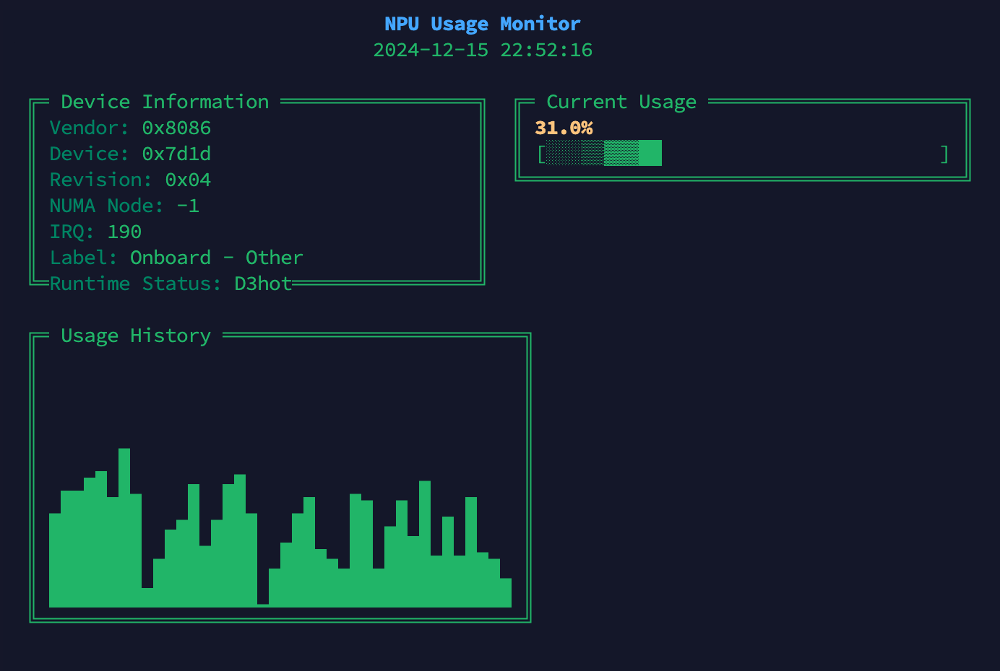

# intel-npu-top

A minimalist, zero-dependency monitoring tool for Intel Meteor Lake NPU usage in real-time via sysfs on Linux. Features clean ASCII-based visualization in just 52 lines of Python.

## Features

* **Dead Simple**: Single Python file, zero dependencies - just copy and run
* **Real-time Monitoring**: Live NPU usage with ASCII bar chart visualization
* **Usage History**: Visual graph of the last 40 samples
* **Clean Interface**: Pure Python + ASCII = prettier than intel_gpu_top 
* **Auto-refresh**: Continuous monitoring out of the box

## Installation

### Standalone Script (Recommended!)
Just copy STANDALONE.py to your system and run it - that's it! No dependencies, no package management, no fuss.

### Also available via PyPI
pip3 install intel-npu-top

### From Source
git clone https://github.com/DMontgomery40/intel-npu-top
cd intel-npu-top
python3 -m pip install .

### Docker (if you really want to...)
docker-compose up
Note: Docker is overkill for local monitoring - but great if you're pulling NPU data from another VM!

## Requirements

* Linux system with Intel Meteor Lake NPU
* Python 3.6 or higher
* Root privileges for NPU sysfs access (required for all installation methods)
  * Verify with: ls -lh /sys/devices/pci0000:00/0000:00:0b.0/accel/accel0

## Usage

### If using standalone script:
sudo python3 STANDALONE.py

### If installed via pip:
sudo intel-npu-top

The interface shows:
- Current NPU usage percentage with visual bar
- Device information (vendor ID, device ID, etc.)
- Historical usage graph
- Runtime status and NUMA node details

## Acknowledgements

This project builds upon [ZoLArk173/nputop](https://github.com/ZoLArk173/nputop). Thanks for the inspiration and groundwork!

## License

MIT License - See LICENSE file for details.

---
Just 52 lines of pure Python. No dependencies. No complications. It just works.
